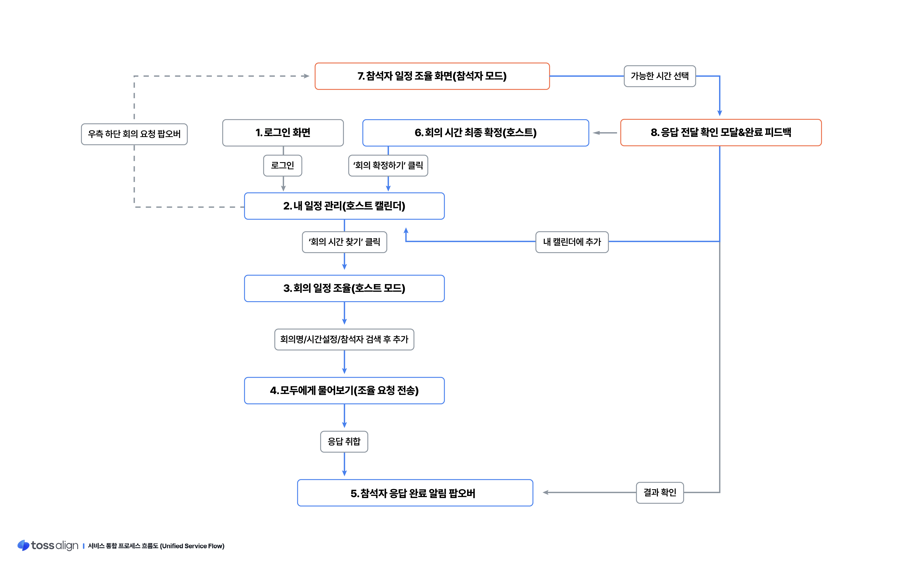

# 토스 프로덕트 디자이너 챌린지 2026 : toss align

프로덕트 디자이너 챌린지 2026 과제 제출을 위한 시간 조율 서비스 웹 프로토타입 저장소입니다.  

아래의 링크를 클릭하면 바로 확인하실 수 있습니다.

[실시간 웹 프로토타입 확인하기 (GitHub Pages)](https://bobong0111.github.io/toss-challenge-2026/)

### 서비스 플로우

---

## 프로젝트 주요 특징 및 구현 기능

### 1. 개인 일정 관리 및 집중 시간(Focus Time) 설정
* **주간 캘린더**: 개인 일정을 한눈에 확인하고 관리할 수 있는 그리드형 캘린더를 제공합니다.
* **집중 시간(Focus Time)**: 회의를 피하고 싶은 시간을 설정하면 캘린더에 자동 반영되며 회의 추천 시 제외됩니다.
* **회의 선호 시간 설정**: 사용자가 선호하는 요일과 시간을 설정하여 추천 결과에 반영합니다.

### 2. 회의 생성 및 참석자 관리
* **회의 생성 위저드**: 회의 이름, 시간, 참석자를 단계적으로 설정하여 회의를 생성할 수 있습니다.
* **회의 템플릿**: 자주 사용하는 회의를 템플릿으로 저장하고 빠르게 재사용할 수 있습니다.
* **참석자 검색**: 이름 검색을 통해 참석자를 빠르게 추가하거나 관리할 수 있습니다.

### 3. 추천 시간 알고리즘 및 참석 가능도 시각화
* **최적 시간 추천**: 참석자들의 일정을 분석하여 가장 적합한 회의 시간을 추천합니다.
* **추천 시간 카드**: 추천도와 참석 가능 인원을 카드 형태로 제공합니다.
* **참석 가능 현황**: 히트맵 차트를 활용하여 해당 시간대에 참석 가능한 인원을 한눈에 볼 수 있도록 만들었습니다.

### 4. 회의 일정 조율 및 참석자 응답
* **회의 초대 및 응답**: 참석자는 요청받은 회의 시간 중 가능한 시간을 선택하여 응답할 수 있습니다.
* **실시간 응답 현황**: 주최자는 참석자의 응답 결과를 즉시 확인할 수 있습니다.
* **회의 확정**: 최종 시간 선택 후 참석자 모두의 캘린더에 회의가 반영됩니다.

### 5. AI 기반 일정 재조율 기능
* **일정 충돌 해결**: 적합한 시간이 없는 경우 AI가 대안을 제안합니다.
* **재조율 옵션**: 회의 시간 단축, 참석자 조정, 분할 회의 등 다양한 방법으로 새로운 시간대를 추천합니다.
* **최적의 대안 제시**: 기존 일정을 최대한 유지하면서 회의 성사 가능성을 높입니다.

